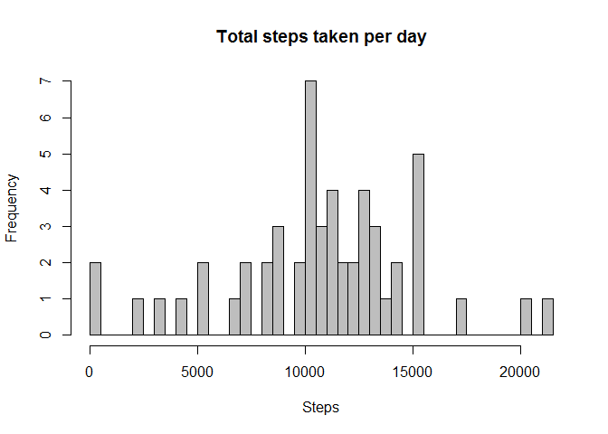
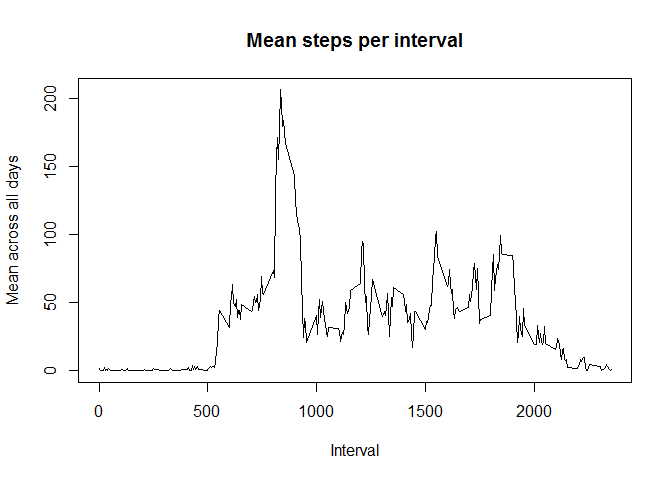
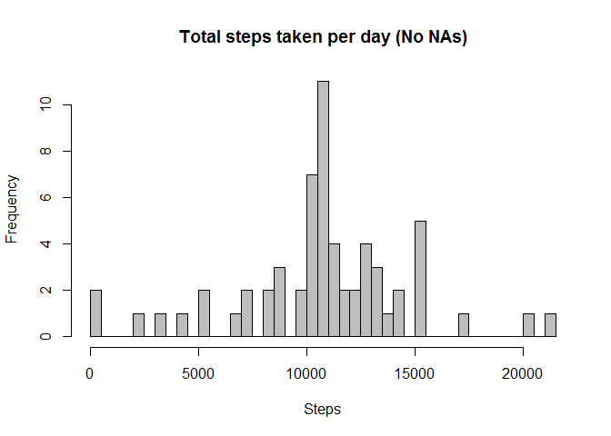
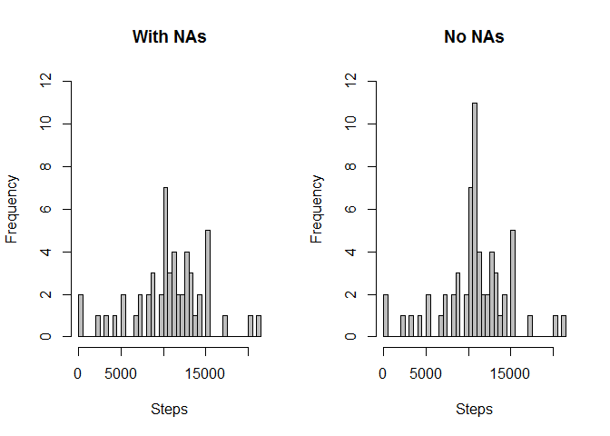
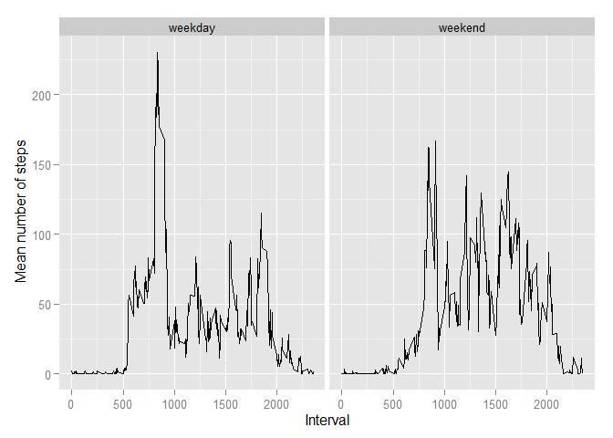

# Reproducible Research: Peer Assessment 1

**Author: Tatyana Toncheva**

**Date: 2015-04-12**

## Description
The purpose of collecting the data and its description are in the README.md file in this repository

## Loading and preprocessing the data
In this repository there is a file activity.zip which contains the data used for this analysis. The following code assumes that the file is downloaded into the working directory. It will unzip and load it into the R environment. I set the columns in the reading of the file.


```r
unzip("activity.zip")
data <- read.csv("activity.csv", stringsAsFactors = F, header = T, colClasses=c("integer", "factor", "integer"))
```
The data is tidy and there's no need to clean it. There are a lot of NA values, but as the instructions of the assignment require they should not be removed at this point.

## What is mean total number of steps taken per day?
Load the needed package

```r
library(dplyr)
```
The following histogram shows the total number of steps taken per day 

```r
data1 <- group_by(data, date)
data1 <- summarise(data1, totalStepsPerDay = sum(steps))
hist(data1$totalStepsPerDay, main = "Total steps taken per day", xlab = "Steps", breaks = nrow(data1), col = "grey")
```

 

```r
meanSteps <- mean(data1$totalStepsPerDay, na.rm = T)
data1 <- arrange(data1, totalStepsPerDay)
medianSteps <- median(data1$totalStepsPerDay, na.rm = T)
```

Mean of total number of steps taken per day

[1] 10766.19

Median of total number of steps taken per day

[1] 10765

## What is the average daily activity pattern?

The following plot represents the 5-minute intervals (x-axis) and the average number of steps taken, averaged across all days (y-axis).


```r
data2 <- group_by(data, interval)
data2 <- summarise(data2, meanPerInterval = mean(steps, na.rm = T), numberSteps = sum(steps, na.rm = T))
plot(data2$interval, data2$meanPerInterval, type = "l", main = "Mean steps per interval", 
     xlab = "Interval", ylab = "Mean across all days")
```

 

And the interval containing the maximum number of steps, averaged across all the days in the dataset is


```r
data2[data2$numberSteps == max(data2$numberSteps), "interval"]
```

```
## Source: local data frame [1 x 1]
## 
##   interval
## 1      835
```

So if we divide the 835 by 60 to get the hour of the day, we could see that the person is most active each day around 2pm when he/she is probably practicing some sports. 

## Imputing missing values
Now I check what is the number of NAs in all of the columns

```r
sum(is.na(data$interval))
```

```
## [1] 0
```


```r
sum(is.na(data$date))
```

```
## [1] 0
```


```r
sum(is.na(data$steps))
```

```
## [1] 2304
```

There are missing values only in the steps column and their percentage is:


```r
mean(is.na(data$steps))*100
```

```
## [1] 13.11475
```

13% is a significant amount of missing data, so the strategy for filling those missing values is to fill each one with the mean of that 5-minute interval as if the person
has a daily routine it is very probable that he will be active in the same way 
during that time interval. A new dataset is created with no missing values:


```r
dataNoNAs <- merge(data, data2, by="interval")
dataNoNAs$steps[!complete.cases(dataNoNAs$steps)] <- dataNoNAs$meanPerInterval[!complete.cases(dataNoNAs$steps)]
dataNoNAs <- subset(dataNoNAs, select = c(interval, steps, date))
```

I will make again a histogram showing the total number of steps taken per day, but with the newly created dataset with populated NA values.


```r
dataNoNAsTmp <- group_by(dataNoNAs, date)
dataNoNAsTmp <- summarise(dataNoNAsTmp, totalStepsPerDay = sum(steps))
hist(dataNoNAsTmp$totalStepsPerDay, main = "Total steps taken per day (No NAs)", xlab = "Steps", breaks = nrow(dataNoNAsTmp), col = "grey")
```

 

The new mean is:


```r
mean(dataNoNAsTmp$totalStepsPerDay)
```

```
## [1] 10766.19
```

The new median is:


```r
dataNoNAsTmp <- arrange(dataNoNAsTmp, totalStepsPerDay)
median(dataNoNAsTmp$totalStepsPerDay)
```

```
## [1] 10766.19
```

As we could see the mean with NAs populated is the same as before, but the median is slightly bigger. To better illustrate the impact of imputing missing data on the estimates of the total daily number of steps I will put the histograms one to each other:


```r
par(mfrow = c(1, 2))
hist(data1$totalStepsPerDay, main = "With NAs", xlab = "Steps", ylim = c(0, 12),
     breaks = nrow(data1), col = "grey")
hist(dataNoNAsTmp$totalStepsPerDay, main = "No NAs", xlab = "Steps", ylim = c(0, 12),
     breaks = nrow(dataNoNAsTmp), col = "grey")
```

 

It can be seen that the values are almost the same except for one steps total number in the middle. So I can conclude that the impact of imputing the missing values is not that big.

## Are there differences in activity patterns between weekdays and weekends?
First I set the locale as my default setting is Cyrillic and I want to see the weekday names in English.


```r
Sys.setlocale("LC_TIME", "English")
```

To get the answer of the above question I will first create a new factor variable in the dataset with two levels – “weekday” and “weekend” indicating whether a given date is a weekday or weekend day.


```r
getWeekday <- function(date) {
    weekday <- weekdays(date)
    if (weekday %in% c("Saturday", "Sunday")) 
    {return ("weekend")}
    else
    {return ("weekday")}
}
dataNoNAs$date <- as.Date(dataNoNAs$date)
weekDays <- sapply(dataNoNAs$date, getWeekday)
dataNoNAs$weekDay <- as.factor(weekDays)
```

The next plot is a time series plot of the 5-minute interval (x-axis) and the average number of steps taken, averaged across all weekday days or weekend days (y-axis).


```r
library(ggplot2)
```


```r
dataNoNAs <- group_by(dataNoNAs, interval, weekDay)
dataFinal <- summarise(dataNoNAs, meanVal = mean(steps))
qplot(interval, meanVal, data = dataFinal, facets = .~weekDay, geom="path", xlab="Interval", 
      ylab=expression("Mean number of steps"))
```

 

So I can conclude that there is a significant difference in the person's activity - on the weekdays there's a bigger activity than on the weekend days.
